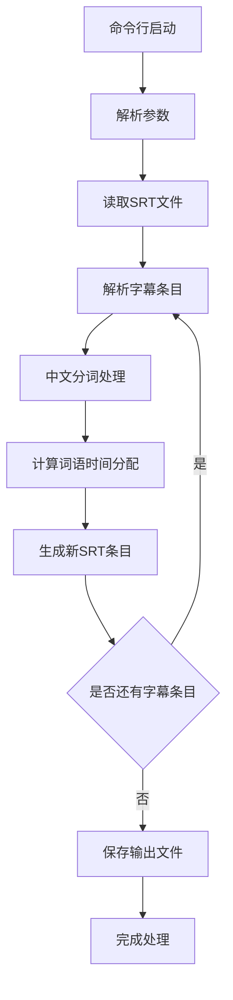

# SRT分词工具产品需求文档

## 1. 产品概述

SRT分词工具是一个基于Node.js的命令行工具，用于将SRT字幕文件从句子级别拆分为词语级别，提高字幕的精细化显示效果。

该工具主要解决传统SRT字幕以句为单位显示时间过长的问题，通过中文分词技术将句子拆分为词语，并按词语字数比例分配时间，使字幕显示更加精准和流畅。

目标用户为视频制作者、字幕编辑人员以及需要精细化字幕处理的开发者。

## 2. 核心功能

### 2.1 用户角色

本工具为命令行工具，无需用户角色区分，所有用户具有相同的使用权限。

### 2.2 功能模块

我们的SRT分词工具需求包含以下主要功能模块：

1. **命令行参数解析**：处理输入输出文件参数
2. **SRT文件解析**：读取和解析SRT字幕文件格式
3. **中文分词处理**：使用NodeJieba进行句子分词
4. **时间分配算法**：按词语字数比例分配时间段
5. **SRT文件生成**：输出新的词语级别SRT文件

### 2.3 功能详情

| 功能模块 | 模块名称 | 功能描述 |
|----------|----------|----------|
| 命令行参数解析 | 参数处理器 | 解析-i输入文件参数和-o输出文件参数，支持省略-o参数时使用默认输出文件名 |
| SRT文件解析 | SRT解析器 | 读取SRT文件，提取字幕序号、时间戳（起始时间、结束时间）和文本内容 |
| 中文分词处理 | 分词引擎 | 使用NodeJieba对每句字幕文本进行中文分词，获取词语数组和每个词的字数 |
| 时间分配算法 | 时间计算器 | 根据原句总时长和各词字数比例，计算每个词的起始时间和结束时间，确保总时长一致 |
| SRT文件生成 | SRT生成器 | 将分词后的词语按新的时间分配生成标准SRT格式文件并保存 |

## 3. 核心流程

用户通过命令行执行工具，指定输入的SRT文件和输出文件名。工具读取原始SRT文件，逐句解析字幕内容，使用NodeJieba进行中文分词，然后根据词语字数比例重新分配时间段，最后生成新的以词为单位的SRT文件。

## 4. 用户界面设计

### 4.1 设计风格

作为命令行工具，本产品无图形用户界面，主要通过以下方式与用户交互：

- **命令行参数**：简洁明了的参数格式
- **控制台输出**：清晰的处理进度和结果提示
- **错误信息**：友好的错误提示和使用说明
- **日志输出**：详细的处理过程日志（可选）

### 4.2 命令行界面设计

| 交互元素 | 元素名称 | 界面描述 |
|----------|----------|----------|
| 命令行参数 | 参数输入 | 支持-i指定输入文件，-o指定输出文件，简洁的参数格式 |
| 进度提示 | 处理状态 | 显示当前处理进度，包括已处理字幕条目数量和总数量 |
| 结果输出 | 完成信息 | 显示处理完成信息，包括输出文件路径和处理统计数据 |
| 错误处理 | 错误提示 | 友好的错误信息提示，包括文件不存在、格式错误等情况的处理建议 |

### 4.3 响应性

本工具为命令行应用，主要考虑不同操作系统的兼容性，优先支持macOS和Linux系统，同时兼容Windows系统的命令行环境。