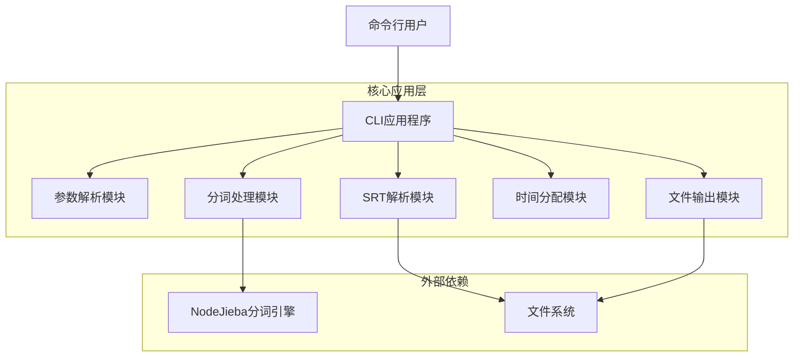
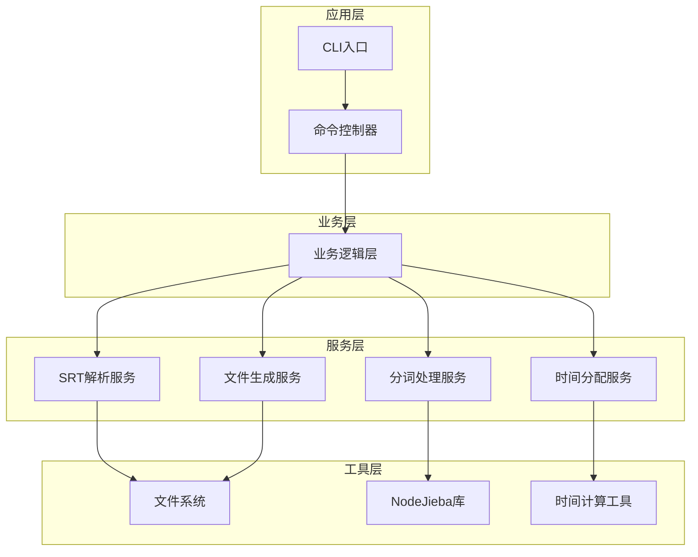
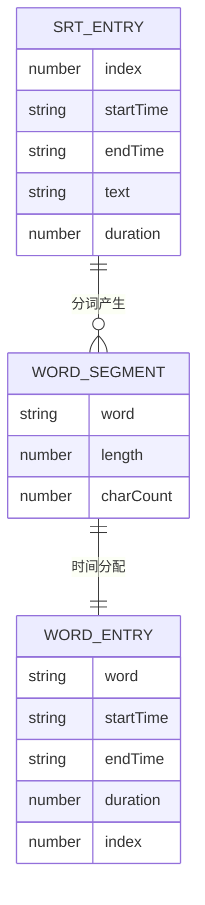

# SRT分词工具技术架构文档

## 1. 架构设计



## 2. 技术描述

- Frontend: 无（纯命令行工具）
- Backend: Node.js@18+ + TypeScript
- 核心依赖: nodejieba@2.6+ (中文分词), commander@9+ (命令行解析)
- 开发工具: ESLint + Prettier (代码规范), Jest (单元测试)
- 构建工具: TypeScript编译器, npm scripts

## 3. 路由定义

作为命令行工具，无传统路由概念，主要通过命令行参数进行功能调用：

| 命令参数 | 功能说明 |
|----------|----------|
| -i, --input <file> | 指定输入的SRT文件路径 |
| -o, --output [file] | 指定输出的SRT文件路径（可选，默认为输入文件名_segmented.srt） |
| -h, --help | 显示帮助信息 |
| -v, --version | 显示版本信息 |

## 4. API定义

### 4.1 核心模块API

#### SRT解析模块
```typescript
/**
 * 解析SRT文件内容
 * @param filePath SRT文件路径
 * @returns 解析后的字幕条目数组
 */
function parseSRTFile(filePath: string): Promise<SRTEntry[]>

/**
 * SRT条目数据结构
 */
interface SRTEntry {
  index: number;        // 字幕序号
  startTime: string;    // 开始时间 (HH:MM:SS,mmm)
  endTime: string;      // 结束时间 (HH:MM:SS,mmm)
  text: string;         // 字幕文本
}
```

#### 分词处理模块
```typescript
/**
 * 对文本进行中文分词
 * @param text 待分词的文本
 * @returns 分词结果数组
 */
function segmentText(text: string): WordSegment[]

/**
 * 词语分段数据结构
 */
interface WordSegment {
  word: string;         // 词语内容
  length: number;       // 词语字符数
}
```

#### 时间分配模块
```typescript
/**
 * 根据词语长度分配时间
 * @param originalEntry 原始字幕条目
 * @param segments 分词结果
 * @returns 分配时间后的词语条目数组
 */
function allocateTime(originalEntry: SRTEntry, segments: WordSegment[]): WordEntry[]

/**
 * 词语条目数据结构
 */
interface WordEntry {
  word: string;         // 词语内容
  startTime: string;    // 开始时间
  endTime: string;      // 结束时间
  duration: number;     // 持续时间（毫秒）
}
```

#### SRT生成模块
```typescript
/**
 * 生成SRT文件
 * @param wordEntries 词语条目数组
 * @param outputPath 输出文件路径
 */
function generateSRTFile(wordEntries: WordEntry[], outputPath: string): Promise<void>
```

## 5. 服务器架构图

作为Node.js命令行工具，采用模块化架构：



## 6. 数据模型

### 6.1 数据模型定义



### 6.2 数据定义语言

作为文件处理工具，主要处理内存中的数据结构，无需数据库。核心数据结构定义如下：

```typescript
// 原始SRT条目接口
interface SRTEntry {
  index: number;                    // 字幕序号
  startTime: string;                // 开始时间戳
  endTime: string;                  // 结束时间戳
  text: string;                     // 字幕文本内容
  duration?: number;                // 持续时间（毫秒，计算得出）
}

// 分词结果接口
interface WordSegment {
  word: string;                     // 分词后的词语
  length: number;                   // 词语字符长度
  position: number;                 // 在原句中的位置
}

// 处理后的词语条目接口
interface WordEntry {
  index: number;                    // 新的序号
  word: string;                     // 词语内容
  startTime: string;                // 分配的开始时间
  endTime: string;                  // 分配的结束时间
  duration: number;                 // 持续时间（毫秒）
  originalIndex: number;            // 原始字幕条目序号
}

// 时间格式转换工具类型
interface TimeStamp {
  hours: number;                    // 小时
  minutes: number;                  // 分钟
  seconds: number;                  // 秒
  milliseconds: number;             // 毫秒
}

// 处理配置接口
interface ProcessConfig {
  inputFile: string;                // 输入文件路径
  outputFile: string;               // 输出文件路径
  minWordDuration: number;          // 最小词语显示时间（毫秒）
  maxWordDuration: number;          // 最大词语显示时间（毫秒）
}
```